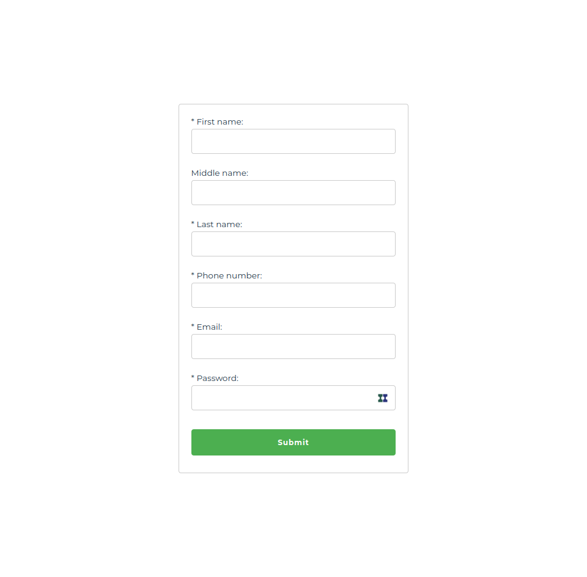

## Client Side

`cd client`

run `npm install` to install dependencies

run `npm run dev` to start the local server

To view list of registered users, visit `http://localhost:5173/users`

:+1: *Check the initial status of a newly registered user via the link above before verifying the user.*

## Server Side

`cd server`

run `npm install` to install dependencies

run `npm run dev` to start the server
